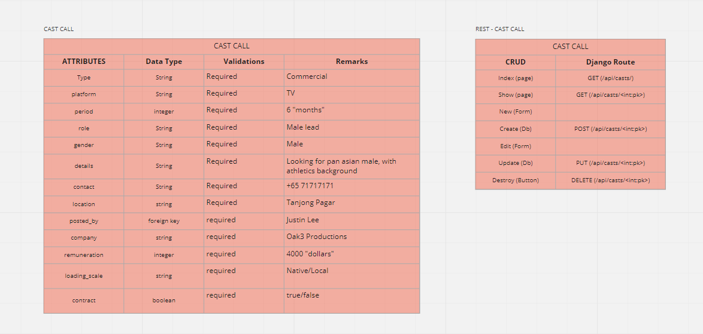

# The Acting Call

Visit the site here: https://project4-tau.vercel.app/

Username - chicken <br>
Password - chicken

## Table of contents

- [Introduction](#introduction)
- [Wireframe](#wireframe)
- [Technologies](#technologies)
- [Setup](#setup)
- [Contributors](#contributors)

## Introduction

The goal of this project is to adapt and create a freelance gig listing website for actors/performers in Singapore. We hope this project will serve as a proof of concept and lay the foundations for future work.

## General User - Personal profile/Browsing/Listing casting calls

- Create your personalised profile page to showcase your talents
- Browse through the directory for casting calls and actor/actress database
- Create and post casting call listings
- Create forum threads and reply to specific forum threads

<p float="left">


</p>

## Wireframe

The wireframe covers the following components:





## Technologies

Project is created with:

- ReactJS
- TailwindCSS
- Python
- Django
- PostgreSQL

Library used in the project:

- [TailwindCSS](https://tailwindcss.com/)
- [axios](https://www.npmjs.com/package/axios)
- [SwiperJS](https://swiperjs.com/)
- [React Router DOM V6](https://reactrouter.com/docs/en/v6/upgrading/v5#upgrade-to-react-router-v6)


## Setup

To run this project, install it locally using npm:

```
$ git clone
$ cd acting-call && npm install
$ npm start
$ npm install
$ npm run dev
```

To run the backend api for project, install it locally using npm:

```
$ git clone
$ cd backend && npm install
$ npm start
$ npm install
$ npm pipenv shell
$ npm pipenv install django
$ npm pipenv python manage.py makemigrations
$ npm pipenv python manage.py migrate
$ npm pipenv python manage.py runserver
$ npm run dev
```

## Contributors

Current:

- Calvin Sim
- Angeal Cheong

